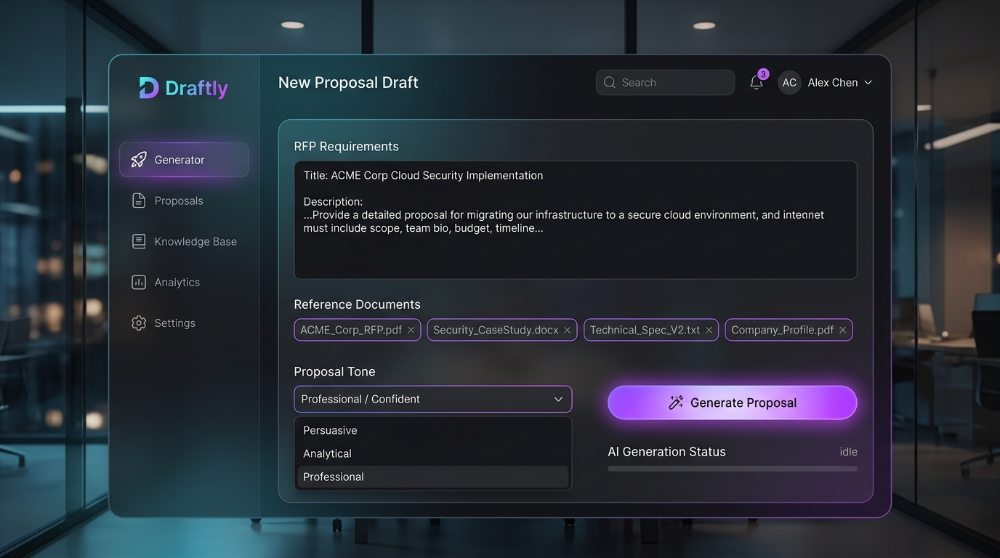
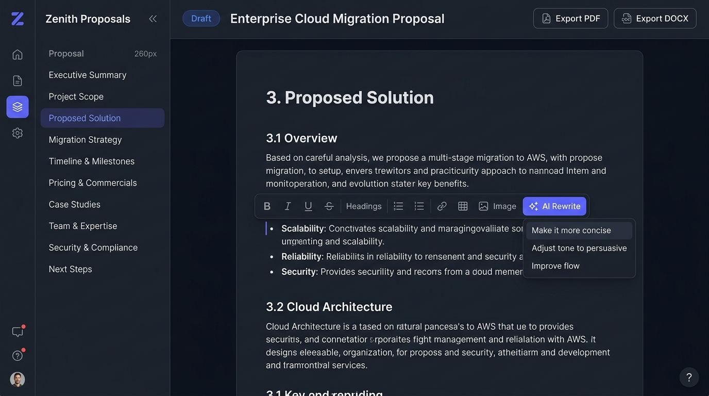
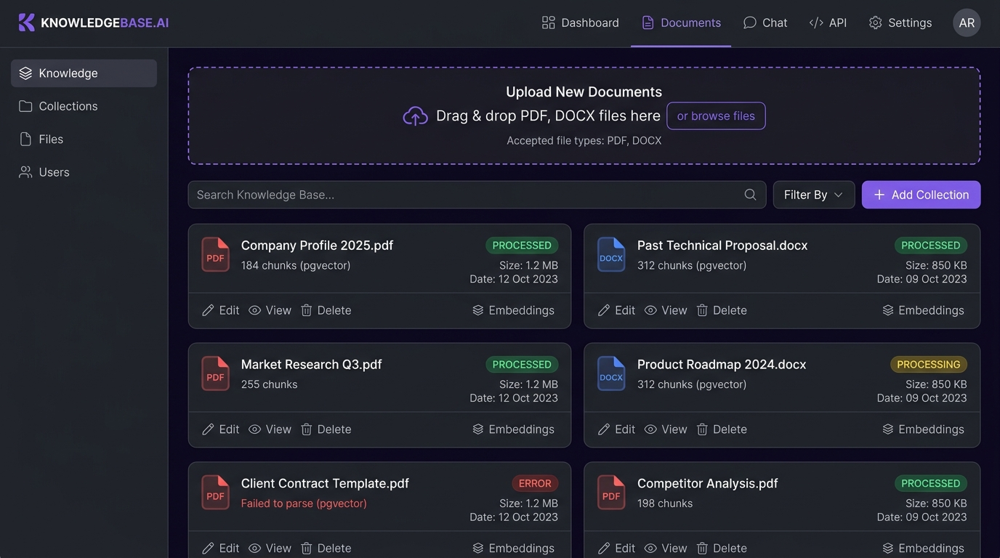
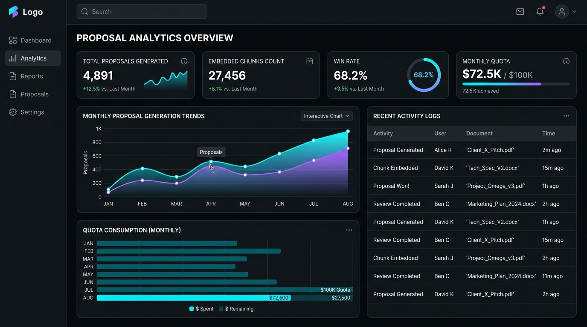

<div align="center">

  # ⚡ Draftly
  ### Enterprise Multi-Tenant AI Proposal & RFP Generator (RAG)

  [](https://python.org)
  [](https://www.django-rest-framework.org/)
  [](https://reactjs.org/)
  [](https://vitejs.dev/)
  [](https://github.com/pgvector/pgvector)
  [](https://docs.celeryq.dev/)
  [](https://stripe.com)
  [](https://www.docker.com/)

  <p align="center">
    <b>Transform hours of manual proposal writing into seconds.</b><br>
    Draftly is a full-stack, production-ready SaaS application that leverages <b>Retrieval-Augmented Generation (RAG)</b>, vector embeddings, and dual-LLM fallback strategies to generate tailored, 10-section RFP proposal drafts from organizational knowledge bases.
  </p>

  <sub>Built with modern software engineering best practices: multi-tenant isolation, async job queues, pgvector similarity search, and automated unit testing.</sub>

</div>

---

## 📋 Table of Contents

- [✨ Recruiter & Engineering Highlights](#-recruiter--engineering-highlights)
- [🖼️ Application Preview & Screenshots](#️-application-preview--screenshots)
- [🎯 Problem & Solution](#-problem--solution)
- [⚡ Core Features](#-core-features)
- [🏗️ Architecture & Data Flow](#️-architecture--data-flow)
- [💻 Tech Stack](#-tech-stack)
- [🚀 Quick Start & Installation](#-quick-start--installation)
  - [Docker Setup (Recommended)](#1-docker-setup-recommended)
  - [Local Development (Without Docker)](#2-local-development-without-docker)
- [🔒 Security & Multi-Tenancy](#-security--multi-tenancy)
- [💳 Billing & Subscription Engine](#-billing--subscription-engine)
- [🧪 Testing & Quality Gate](#-testing--quality-gate)
- [📖 API Reference Summary](#-api-reference-summary)
- [📄 License & Contact](#-license--contact)

---

## ✨ Recruiter & Engineering Highlights

If you're evaluating this repository for technical competence, here are the core architectural highlights:

* 🧠 **Production RAG Engine**: Implements end-to-end vector retrieval with `pgvector` and Google AI `text-embedding-004` (768-dimensional embeddings), chunking documents into ~500-word segments with 50-word overlap for high context recall.
* 🛡️ **Fault-Tolerant Dual-LLM Pipeline**: Primary generation uses **Google Gemini 2.5 Flash**. On encountering rate limits (HTTP 429), the task seamlessly falls back to **Groq `llama-3.1-8b-instant`**, ensuring high uptime.
* 🏢 **Strict Multi-Tenant Isolation**: Custom Django REST Framework permissions (`IsOrgMember`, `OrgDocQuotaPermission`, `OrgProposalQuotaPermission`) ensure zero cross-tenant data leakage and enforce strict row-level security on all database queries.
* ⚡ **Asynchronous Worker Architecture**: Non-blocking document ingestion and proposal generation executed via **Celery** with **Redis** as broker/result backend, featuring status polling and exponential backoff retries.
* 💳 **Full Stripe Subscription Integration**: End-to-end monetization featuring Stripe Checkout, Customer Portal, and webhook signature verification with idempotency protection via `StripeEvent` logging.
* 🧪 **Robust Automated Test Suite**: Full test coverage with `pytest` on the backend and `Vitest` + `React Testing Library` + `MSW` (Mock Service Worker) on the frontend, protected by pre-push hooks.

---

## 🖼️ Application Preview & Screenshots

### 1. Proposal Generator & RFP Workspace
*Paste RFP requirements, select past company case studies, customize generation tone, and trigger AI drafting.*



---

### 2. Interactive 10-Section Proposal Editor
*WYSIWYG section-by-section proposal editor featuring real-time status polling, prompt refinement, and PDF / DOCX export capabilities.*



---

### 3. RAG Knowledge Base & Document Library
*Multi-format document ingestion (PDF, DOCX, TXT), vector chunking status indicators, metadata tracking, and semantic search.*



---

### 4. Real-Time Analytics & Quota Monitor
*Comprehensive org analytics displaying proposal volume trends, word counts, active vector chunk metrics, and monthly tier quota usage.*



---

## 🎯 Problem & Solution

| Problem | Draftly Solution |
| :--- | :--- |
| **Time-Consuming RFPs**: B2B sales teams spend 15+ hours drafting proposals manually. | **Sub-60s Draft Generation**: Draftly builds structured, 10-section proposals in seconds. |
| **Hallucinations & Generic Reponses**: Off-the-shelf LLMs output generic, ungrounded text. | **Grounding via RAG**: Proposals are strictly synthesized from company case studies & reference docs. |
| **Formatting Inconsistencies**: Proposals lack standard corporate structure. | **Deterministic 10-Section Schema**: Guarantees standard executive summary, methodology, pricing, etc. |
| **Data Privacy Risks**: Mixing client context across organizations. | **Tenant-Isolated Vector Store**: pgvector cosine search is strictly scoped by `org_id`. |

---

## ⚡ Core Features

### 📄 1. RAG Knowledge Base Ingestion
- Upload PDF, DOCX, and TXT company documents.
- Automatic text extraction via `PyMuPDF` and `python-docx`.
- Smart word-based chunking with configurable overlap.
- Batched embedding generation stored directly in PostgreSQL using `pgvector`.

### 📝 2. AI Proposal Generation Engine
- Automatically parses RFP requirements and generates 10 tailored sections:
  1. Executive Summary
  2. Understanding Requirements
  3. Proposed Solution
  4. Relevant Experience
  5. Team Qualifications
  6. Project Timeline
  7. Methodology
  8. Pricing Structure
  9. Why Choose Us
  10. Appendix & Terminology
- Automatic LLM fallback strategy (Gemini 2.5 Flash ➡️ Groq Llama 3.1 8B).

### ✏️ 3. Rich Editor & Export Tools
- Section-by-section Tiptap rich-text editor in React.
- Export finalized proposals directly to **PDF** (styled layout) or **DOCX** (editable Word document).

### 📊 4. Tiered Quota & Billing Management
- Subscription tiers: **Free**, **Solo**, **Studio**, and **Agency**.
- Real-time enforcement of document uploads and monthly proposal generation limits.
- Automated monthly quota resets on the 1st of each month (UTC).

---

## 🏗️ Architecture & Data Flow

```
                               ┌────────────────────────────────────────────────────────┐
                               │                    React 18 SPA                        │
                               │  Vite • Zustand • Tiptap • Recharts • Axios Interceptor │
                               └───────────────────────────┬────────────────────────────┘
                                                           │ HTTPS (JWT Auth)
                               ┌───────────────────────────▼────────────────────────────┐
                               │                  Django REST Framework                 │
                               │     Auth • Multi-Tenant Permissions • REST Endpoints   │
                               └──────────┬──────────────────┬──────────────────┬───────┘
                                          │                  │                  │
                                          ▼                  ▼                  ▼
                                   ┌──────────────┐   ┌──────────────┐   ┌──────────────┐
                                   │  PostgreSQL  │   │ Celery Queue │   │ External AI  │
                                   │  + pgvector  │   │  + Redis     │   │ APIs & Stripe│
                                   └──────────────┘   └──────────────┘   └──────────────┘
```

### Async Document & RAG Pipeline Flow

```
[User Upload] ──> [Django REST API] ──> [Save File] ──> [Celery Task]
                                                             │
   ┌─────────────────────────────────────────────────────────┴─────────────────────────────────────────┐
   │ 1. Extract raw text (PyMuPDF / python-docx)                                                       │
   │ 2. Split into ~500-word overlapping chunks                                                         │
   │ 3. Batch embed via Google AI text-embedding-004                                                  │
   │ 4. Store vectors in PostgreSQL (pgvector) scoped to tenant org_id                                 │
   └─────────────────────────────────────────────────────────┬─────────────────────────────────────────┘
                                                             │
[Proposal Request] ──> [Embed RFP Query] ──> [Cosine Vector Search] ──> [Prompt Gemini / Groq] ──> [10-Section Draft]
```

### Core Data Models Schema

| Model | Purpose | Key Attributes / Relationships |
| :--- | :--- | :--- |
| **Organization** | Tenant boundary & billing | `subscription_tier`, `doc_quota`, `proposal_quota`, Stripe IDs |
| **User** | Tenant member | `org` (FK), `email`, `role` (`admin`/`member`), `is_active` |
| **Document** | Raw uploaded knowledge | `org` (FK), `uploaded_by` (FK), `file_type`, `status` (`processed`/`failed`) |
| **Chunk** | Embedded text segment | `document` (FK), `org` (FK), `content`, `embedding` (`vector(768)`) |
| **RFP** | Target proposal request | `org` (FK), `created_by` (FK), `title`, `raw_text` |
| **Proposal** | Final generated output | `rfp` (FK), `org` (FK), `sections` (`JSONField`), `status` (`draft`/`final`) |

---

## 💻 Tech Stack

### Backend & Infrastructure
- **Framework**: Python 3.11, Django 5.0, Django REST Framework
- **Task Queue**: Celery 5.3, Redis 7 (Broker & Backend)
- **Database**: PostgreSQL 16 with `pgvector` extension
- **Authentication**: djangorestframework-simplejwt (JWT Access/Refresh tokens)
- **Error Monitoring**: Sentry SDK (Backend + Celery workers)

### AI & Machine Learning
- **Vector Embeddings**: Google AI `models/text-embedding-004` (768 dimensions)
- **Primary LLM**: Google Gemini 2.5 Flash
- **Fallback LLM**: Groq `llama-3.1-8b-instant`
- **Text Parsing**: PyMuPDF (`fitz`), `python-docx`

### Frontend
- **Framework**: React 18, Vite 5
- **State Management**: Zustand
- **WYSIWYG Editor**: Tiptap Editor (`@tiptap/react`)
- **Data Visualization**: Recharts
- **HTTP Client**: Axios with auto-refresh token interceptors
- **Styling**: Modern Vanilla CSS Design System with dark mode support

---

## 🚀 Quick Start & Installation

### Prerequisites
- [Docker](https://www.docker.com/) and Docker Compose installed.
- A **Google AI Studio API Key** (`GEMINI_API_KEY`).
- *(Optional)* **Groq API Key** for fallback execution.

---

### 1. Docker Setup (Recommended)

1. **Clone the repository:**
   ```bash
   git clone https://github.com/your-username/draftly.git
   cd draftly
   ```

2. **Configure environment variables:**
   ```bash
   cp .env.example .env
   ```
   Open `.env` and fill in your credentials:
   ```env
   GOOGLE_AI_API_KEY=your_gemini_api_key_here
   GROQ_API_KEY=your_groq_api_key_here
   SECRET_KEY=your_django_secret_key
   ```

3. **Spin up all containers (Database, Redis, Backend API, Worker, Frontend):**
   ```bash
   docker compose --profile localdb up --build
   ```

4. **Run database migrations & create admin user:**
   ```bash
   docker compose exec backend python manage.py migrate
   docker compose exec backend python manage.py createsuperuser
   ```

5. **Access the Application:**
   - 🌐 **Frontend SPA**: `http://localhost:5173`
   - ⚙️ **Django REST API**: `http://localhost:8000/api/`
   - 🔧 **Django Admin Panel**: `http://localhost:8000/admin/`

---

### 2. Local Development (Without Docker)

#### Backend & Worker Setup
```bash
cd backend

# Create virtual environment
python -m venv .venv
source .venv/bin/activate  # On Windows: .venv\Scripts\activate

# Install dependencies
pip install -r requirements.txt

# Run migrations & start server
python manage.py migrate
python manage.py runserver 8000

# Terminal 2 - Start Celery worker
celery -A config worker --loglevel=info
```

#### Frontend Setup
```bash
cd frontend

# Install Node packages
npm install

# Start Vite development server
npm run dev
```

---

## 🔒 Security & Multi-Tenancy

Draftly enforces security at every layer of the application stack:

1. **Row-Level Organization Scoping**: All models explicitly reference an `Organization`. Queries automatically inject `.filter(org=request.user.org)` via permissions.
2. **Permission Guardrails**: Custom permission classes inspect subscription quotas before executing heavy Celery tasks.
3. **Vector Store Scoping**: Vector similarity queries in `pgvector` append standard SQL `WHERE org_id = %s` conditions to prevent cross-tenant context injection.
4. **JWT Lifecycle**: Short-lived access tokens with automatic token rotation via refresh endpoints.

---

## 💳 Billing & Subscription Engine

Draftly features a fully implemented Stripe billing engine in `apps/billing/`:

* **Tier Resolution**: Resolves subscription tiers directly from Stripe line-item price IDs.
* **Webhook Handling**: Handlers for `checkout.session.completed`, `customer.subscription.updated`, `customer.subscription.deleted`, `invoice.paid`, and `invoice.payment_failed`.
* **Idempotency**: Prevents duplicate webhook processing using a dedicated `StripeEvent` event tracking model.

---

## 🧪 Testing & Quality Gate

Draftly includes a comprehensive automated test suite to ensure system reliability and regression testing.

### Backend Tests (pytest)
```bash
cd backend
pytest                             # Run all tests
pytest --cov=apps --cov-report=html # Run with HTML coverage report
ruff check . && ruff format --check . # Run linter & formatter
```

### Frontend Tests (Vitest)
```bash
cd frontend
npm test                # Watch mode
npm run test:run        # Single run execution
npm run test:cov        # Coverage report
npm run lint            # ESLint check
```

### Pre-Commit & Pre-Push Hook Gate
The repository enforces pre-push checks via `.pre-commit-config.yaml` to ensure code formatting, linting, and tests pass before git pushes are accepted.

---

## 📖 API Reference Summary

| Method | Endpoint | Description | Auth Required |
| :--- | :--- | :--- | :---: |
| `POST` | `/api/accounts/register/` | Register user and organization | ❌ |
| `POST` | `/api/accounts/login/` | Obtain JWT access/refresh token pair | ❌ |
| `GET` | `/api/accounts/me/` | Fetch current user & org quotas | 🔒 |
| `GET` | `/api/documents/` | List organization knowledge documents | 🔒 |
| `POST` | `/api/documents/` | Upload document (triggers async ingestion) | 🔒 |
| `POST` | `/api/rfps/` | Create RFP record | 🔒 |
| `POST` | `/api/proposals/generate/` | Trigger AI RAG proposal generation task | 🔒 |
| `GET` | `/api/proposals/{id}/` | Get proposal details & sections | 🔒 |
| `GET` | `/api/analytics/stats/` | Fetch org analytics dashboard stats | 🔒 |
| `POST` | `/api/billing/create-checkout/` | Initiate Stripe Checkout session | 🔒 |
| `POST` | `/api/billing/webhook/` | Stripe Webhook listener endpoint | Webhook Signature |

---

## 📄 License & Contact

Distributed under the **MIT License**. See `LICENSE` for more information.

<div align="center">

  **Crafted with precision by Hassan Zafar**
  
  [](https://linkedin.com)
  [](https://github.com)
  [](https://google.com)

</div>
