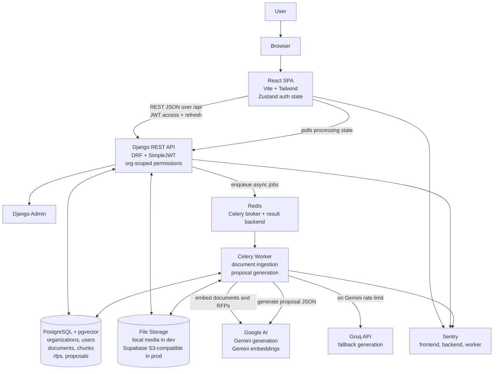
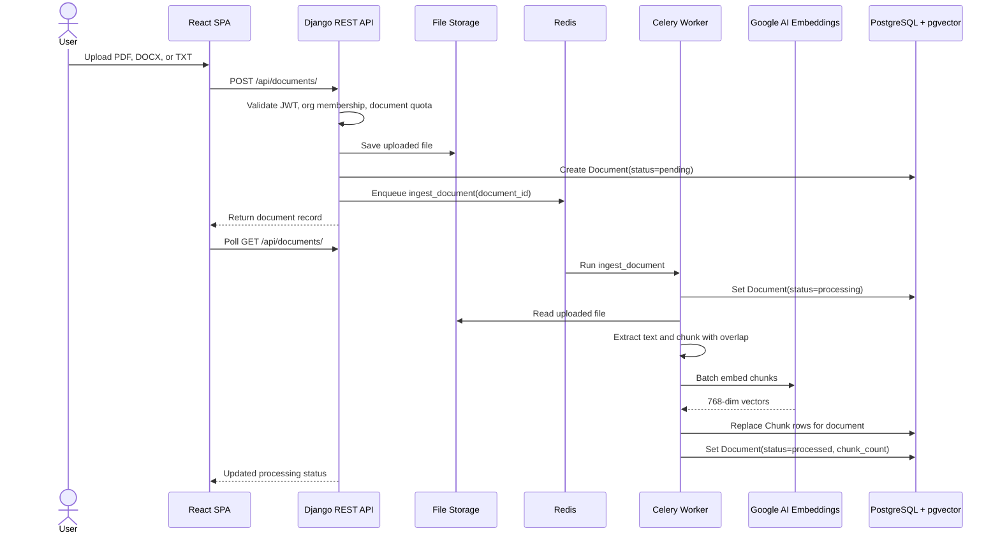
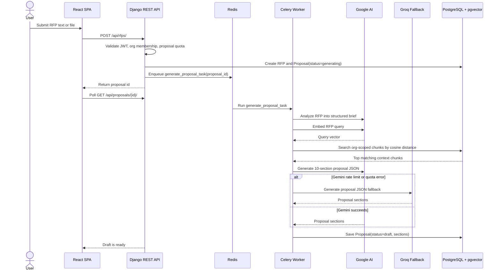
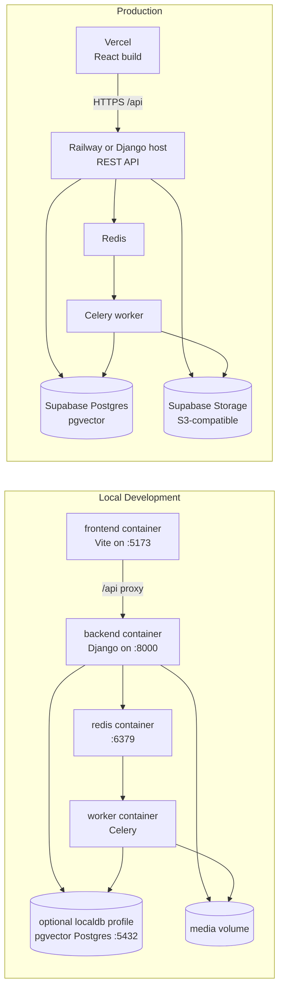

# Draftly Architecture Diagram

Draftly is a multi-tenant SaaS app for RAG-assisted proposal generation. Users upload reference documents, the backend extracts and embeds chunks into pgvector, and new RFPs are used to retrieve relevant context before an LLM writes a structured proposal draft.

## System Overview

## Document Ingestion Flow

## Proposal Generation Flow

## Deployment Topology

## Core Boundaries

| Boundary | Responsibility |
| --- | --- |
| `frontend/src` | Authenticated SPA, document upload, RFP submission, proposal editing, PDF export, polling for async status. |
| `backend/apps/accounts` | Organizations, users, roles, JWT-facing auth views, subscription tier quota metadata. |
| `backend/apps/documents` | Uploaded document models, extraction, chunking, embedding, chunk persistence. |
| `backend/apps/proposals` | RFP and proposal models, proposal generation task, RAG retrieval, LLM prompt and fallback handling. |
| `backend/apps/core` | Shared embeddings client and DRF permission classes for org scope and quota enforcement. |

## Important Notes

- Tenant isolation is enforced through `org` foreign keys and org-scoped querysets/permissions.
- Vector search is filtered by `org_id` before ranking chunks by pgvector cosine distance.
- The frontend currently polls async status rather than using SSE or WebSockets.
- The current embedding dimension is 768, configured for Google Gemini embeddings.
- Gemini is the primary generation provider; Groq is only used as a rate-limit fallback.
