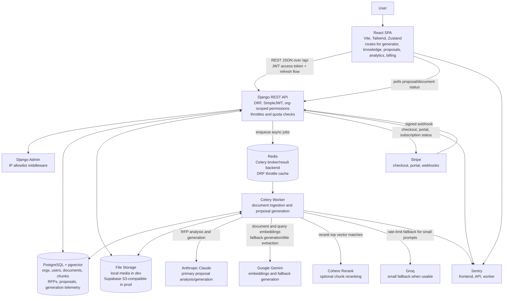
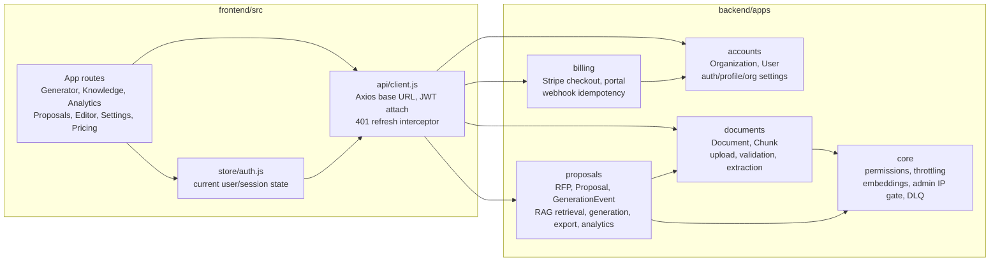
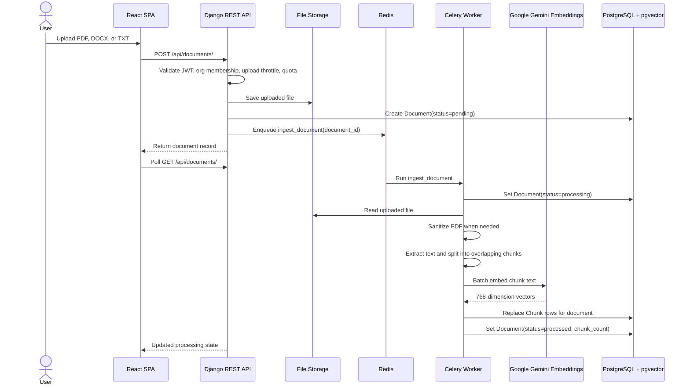
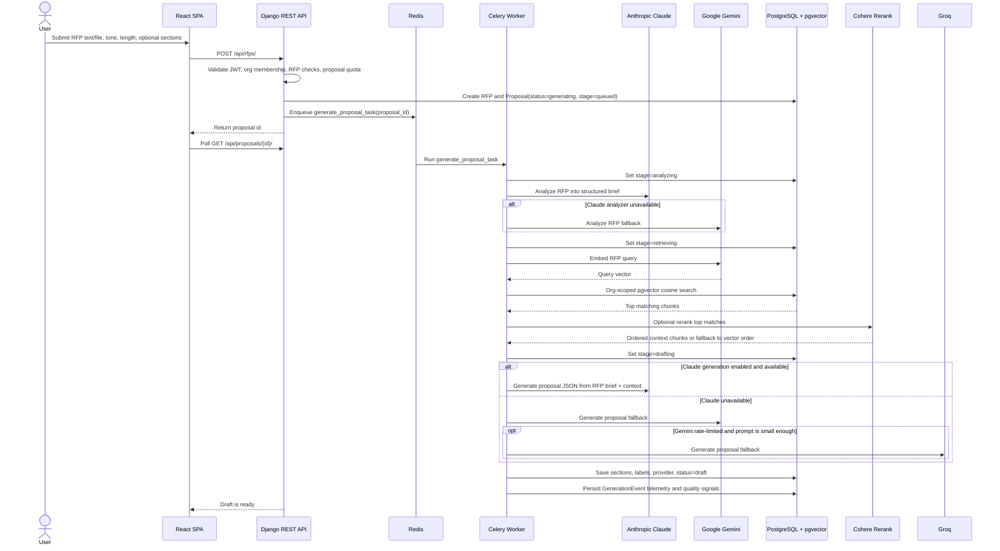
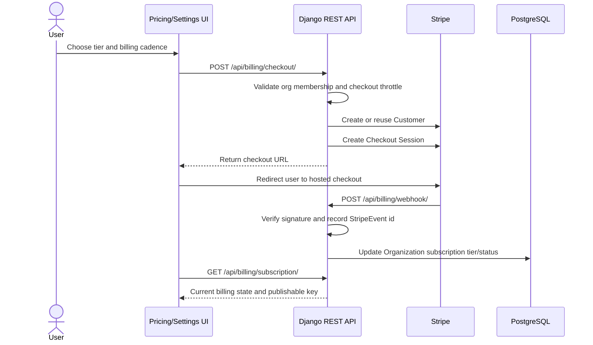
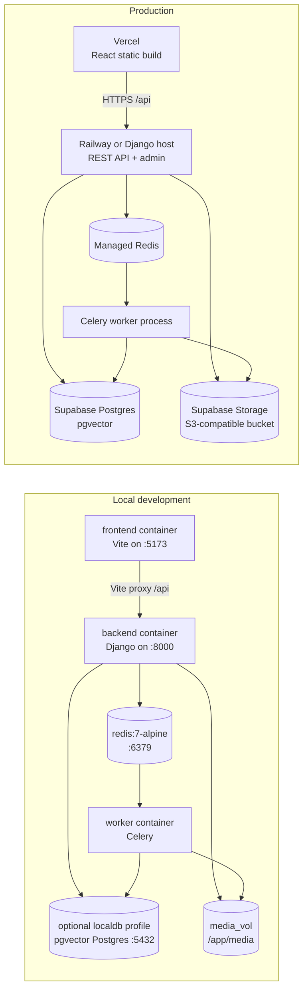

# Draftly Architecture Diagram

Draftly is a multi-tenant proposal generation SaaS. Teams upload reusable company knowledge, Draftly extracts and embeds that content, then new RFPs retrieve the most relevant chunks before an LLM drafts a structured proposal.

## System Context

## Runtime Boundaries

## Document Ingestion Flow

## Proposal Generation Flow

## Billing Flow

## Deployment Topology

## Data Ownership

| Area | Owns | Notes |
| --- | --- | --- |
| `accounts` | `Organization`, `User` | Subscription tier determines document, proposal, and seat quotas. |
| `documents` | `Document`, `Chunk` | Chunks carry `org_id`, source metadata, category, and 768-dimension Gemini embeddings. |
| `proposals` | `RFP`, `Proposal`, `GenerationEvent` | Generation stores stage metadata, selected provider, retrieval telemetry, and quality signals. |
| `billing` | `StripeEvent` | Stripe event ids make webhook processing idempotent. |
| `core` | shared infrastructure | Permission checks, throttles, embeddings client, admin IP allowlist, and task failure recording. |

## Important Constraints

- Tenant isolation is enforced through `org` foreign keys, org-scoped querysets, and `IsOrgMember` permissions.
- Vector search filters by `org_id` before ranking chunks by pgvector cosine distance.
- Proposal status is exposed through polling; there is no active SSE or WebSocket path in the current code.
- Claude is the primary proposal provider when enabled and configured; Gemini is used for embeddings and fallback generation.
- Cohere rerank is optional and safely falls back to vector order when disabled or unavailable.
- File storage is local by default and switches to Supabase S3-compatible storage with `USE_SUPABASE_STORAGE=True`.
